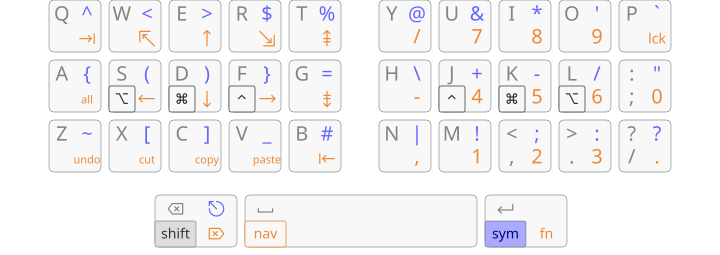
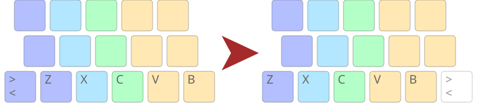
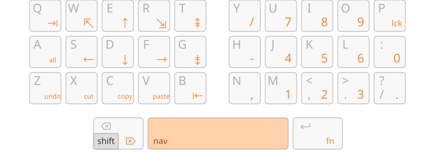
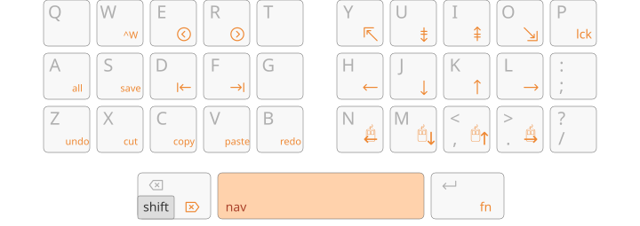
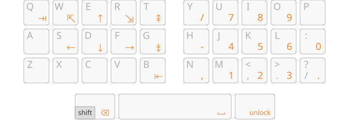
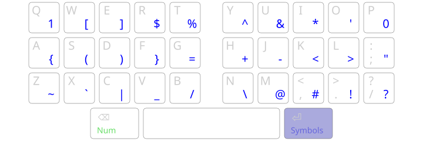
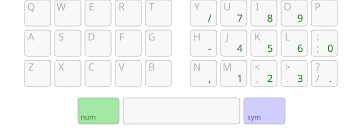
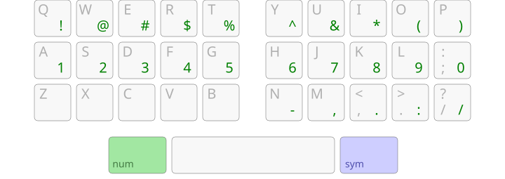
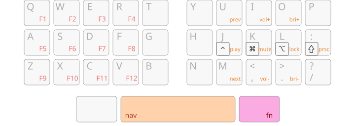

Arsenik
================================================================================

An intuitive approach to minimize finger movements on *any* keyboard:

- programmable or not
- any geometry: ANSI, ISO, ortholinear, split…
- any layout: QWERTY, AZERTY, QWERTZ, Dvorak, Colemak, Ergo‑L…

> [!NOTE]
> All releases have been moved to Ækeynox repositories (Kanata, QMK, ZMK). 
> [More details in the “Installation” section.](#installation)

Table of Contents

- [Philosophy](#philosophy)
- [Pick Your Poison](#pick-your-poison)
  1. [Angle Mod](#1-angle-mod)
  2. [Thumb-Taps](#2-thumb-taps)
  3. [Home Row Mods](#3-home-row-mods)
  4. [Spice It Up](#4-spice-it-up)
- [Layers](#layers)
  - [Navigation](#navigation)
  - [Symbols](#symbols)
  - [Numbers](#numbers)
  - [FunMedia](#funmedia)
- [Installation](#installation)
- [Why “Arsenik”?](#why-arsenik)

Philosophy
--------------------------------------------------------------------------------

**Bring the keys to your fingers, rather than moving your fingers to the keys.**

Not sure if you should buy that expensive ergonomic keyboard?

Download a ready-to-use Arsenik configuration for [Kanata], and enjoy your
regular features that were normally only accessible to a programmable
keyboard.

Pick Your Poison
--------------------------------------------------------------------------------

Arsenik is designed to learn home row mods step by step. The following features
pave a natural progression.

### 1. Angle Mod

On an ISO keyboard, it permutes the extra down-left key to ease the angle on
your left wrist when [touch typing]. This makes any staggered keyboard almost
ortholinear.

On an ANSI keyboard, the left <kbd>Shift</kbd> key becomes Z (“fat Z”). This
supposes home row mods are enabled (see below).

On an ortholinear keyboard, you don’t want this option, obviously.

### 2. Thumb-Taps

If you’re new to mod-taps, we suggest to start by adding the “layer-tap” option
where only the thumbs are affected:

- the left thumb key remains a <kbd>Cmd</kbd> or <kbd>Alt</kbd> key when held,
but emits a <kbd>Backspace</kbd> when tapped;
- the right thumb key brings the <kbd>Symbols</kbd> layer when held (in blue)
— where all programming symbols are arranged for comfort and efficiency — and
emits <kbd>Return</kbd> when tapped;
- the spacebar brings the <kbd>Navigation</kbd> layer when held (in orange).

Having <kbd>Backspace</kbd> and <kbd>Enter</kbd> under the thumbs is enough to
reduce pinky fatigue very significantly. And using the <kbd>Symbols</kbd>
and <kbd>Navigation</kbd> layers further reduces hand and finger movements.

### 3. Home Row Mods

When you are familiar with mod-taps, it’s time to enable them on the home row
with the “HRM” variants:

- <kbd>FDS</kbd> and <kbd>JKL</kbd> become <kbd>Alt</kbd>, <kbd>Ctrl</kbd>,
<kbd>Super</kbd> when held long enough;
- the left thumb key can now emit a <kbd>Shift</kbd> rather than <kbd>Alt</kbd>
when held.

The most frequent modifier is assigned to the middle finger, and the second
most frequent to the index. Therefore, the HRM order is different on Mac:

This is a variant of the [Miryoku] principle: one layer on each thumb key, and
symmetrical modifiers on the home row. A big difference, though, is that
<kbd>Shift</kbd> becomes a thumb key:

Arsenik is very opinionated *against* <kbd>Shift</kbd> as a home row mod.
<kbd>Shift</kbd> has specific timing and position requirements, which are much
easier to meet with a thumb key.

### 4. Spice It Up

Once home row mods are mastered, it may be time to fine-tune your configuration.

Timing is key. There are several kinds of mod-taps, depending on the priority:

- *hold-preferred* for <kbd>Shift</kbd> and <kbd>Sym</kbd>: they behave as a
  *tap* only when released before 150 ms;
- *tap-preferred* for <kbd>Space</kbd> and HRMs: they behave as a layer or
  modifier only when pressed longer than 300 ms.

These delays are very safe/conservative to be beginner-friendly. When you get
fluent with HRMs, you might want to reduce the 300 ms delay a bit (250 ms is
okay, 200 ms is too quick for most users).

Note that Kanata can also use the laptop’s trackpoint buttons (e.g. on a ThinkPad)
as two additional thumb keys. :-)

Layers
--------------------------------------------------------------------------------

### Navigation

- the <kbd>Navigation</kbd> layer can be either <kbd>NavNum</kbd> or
  <kbd>VimNav</kbd>
- in both cases, <kbd>NavNum</kbd> can be locked with <kbd>nav</kbd><kbd>P</kbd>

#### NavNum

The default <kbd>Navigation</kbd> layer has an arrow cluster on the left hand to
move around, and a num pad on the right hand.

#### VimNav

The alternative <kbd>Navigation</kbd> layer has:
- under the left hand, <kbd>Tab</kbd> / <kbd>Shift</kbd><kbd>Tab</kbd> and
  <kbd>Previous</kbd> / <kbd>Next</kbd> navigation keys;
- under the right hand, an <kbd>HJKL</kbd> arrow cluster and a mouse scroll
  emulation.

This <kbd>Navigation</kbd> layer has a few empty slots on purpose, so you can
add your own keys or layers.

#### NavLock

<kbd>Nav</kbd><kbd>P</kbd> locks the default navigation layer: it remains
active without holding any key until escaped with <kbd>Sym</kbd>.

### Symbols

The <kbd>Symbols</kbd> layer is optimized for programming. The most frequent
symbols are on the left home row, and most common combos can be done either
with a roll or a hand alternation: no same-finger bigram.

### Numbers

In <kbd>Symbols</kbd> mode, pressing the left thumb key brings up the
<kbd>Numbers</kbd> layer. This is handy when mixing symbols and numbers,
e.g. `(0)`, `[1]`, etc.

Two alternatives are proposed: <kbd>NumPad</kbd> and <kbd>NumRow</kbd>.

#### NumPad

By default, the <kbd>Numbers</kbd> layer uses the same num pad as the default
<kbd>Navigation</kbd> layer:

#### NumRow

Optionally, the <kbd>Numbers</kbd> layer can use a numeric row:

- all digits are on the home row, with the finger assignment you already know;
- the upper row helps with <kbd>Shift</kbd>-digit shortcuts;
- the lower row has dash, comma, dot and slash signs to help with number/date
  inputs (+ empty slots under the left hand);
- <kbd>Space</kbd> becomes <kbd>Shift</kbd>-<kbd>Space</kbd>, which can be a
  no-break space for some keyboard layouts.

### FunMedia

In <kbd>Navigation</kbd> mode, pressing the right thumb key brings up the
<kbd>FunMedia</kbd> layer.

Note that home row mods are *always* enabled under the right hand on this layer,
with an additional <kbd>Shift</kbd> key on the pinky.

Installation
--------------------------------------------------------------------------------

- [Ækeynox-kanata] for non-programmable keyboards
- [Ækeynox-QMK] for QMK keyboards
- [Ækeynox-ZMK] for ZMK keyboards

[Ækeynox-kanata]: https://github.com/OneDeadKey/kanata-config-aekeynox
[Ækeynox-QMK]:    https://github.com/OneDeadKey/qmk-config-aekeynox
[Ækeynox-ZMK]:    https://github.com/OneDeadKey/zmk-config-aekeynox

### Non-Programmable Keyboards

Arsenik can be installed as a configuration for your PC or Mac with
[Ækeynox-kanata] (Windows, macOS, Linux). We recommend using:

- the angle-mod for laptop keyboards with a short spacebar (5u);
- the wide angle-mod for desktop keyboards with a long spacebar (6.25u or more).

This implementation used to be developed in this repository, but it’s been fully
refactored, and it now lives in its own repository.

Kanata has been favored because for its features and active development, but
other desktop implementations would be nice to see as well: KMonad, keyd,
Karabiner….

### Programmable Keyboards

Arsenik can be installed on most programmable keyboards:

- either “as is” on ANSI/ISO keyboards, or on ergonomic keyboards with a central
  space bar (Planck, Preonic, Reviung…);
- or with the [Selenium] variant, for split keyboards with at least two keys
  per thumb.

There are two implementations, [Ækeynox-QMK] and [Ækeynox-ZMK], for QMK and ZMK
keyboards, respectively. Both are actively maintained.

Why “Arsenik”?
--------------------------------------------------------------------------------

33 keys layout: the 33rd element of the periodic table.

Unlike Miryoku, which requires 6 thumb keys, Arsenik has been designed to work
with standard ANSI/ISO/laptop keyboards, leveraging the spacebar and the two
Alt/Cmd keys.

### Inspiration

- [Miryoku] for the main idea of using modifiers on the home row and layer
shifters under the thumbs
- [Lafayette] and [Ergo-L] for the <kbd>Symbols</kbd> layer, which has been
shamelessly taken *as is*
- [Extend], [Neo], [Shaka34] for the <kbd>Navigation</kbd> layer

### Alternative Symbols Layers

- [Neo]
- [Seniply]
- [Pascal Getreuer’s]

### Similar Projects

- [Miryoku]: 36 keys, 6 layers, <kbd>Shift</kbd> as home row mod
- [Seniply]: 34 keys, 6 layers, no layer-taps (“Callum-style”)
- [Selenium]: 34 keys, an Arsenik variant for split keyboards

[Kanata]: https://github.com/jtroo/kanata
[Miryoku]: https://github.com/manna-harbour/miryoku
[touch typing]: https://en.wikipedia.org/wiki/Touch_typing
[Lafayette]: https://qwerty-lafayette.org/
[Ergo-L]: https://ergol.org
[Kanata keys]: https://github.com/jtroo/kanata/blob/main/parser/src/keys/mod.rs#L159
[Extend]: https://dreymar.colemak.org/layers-extend.html
[Neo]: https://neo-layout.org
[Shaka34]: https://github.com/lobre/shaka34
[Seniply]: https://stevep99.github.io/seniply/
[Pascal Getreuer’s]: https://getreuer.info/posts/keyboards/symbol-layer/#my-symbol-layer
[Selenium]: https://onedeadkey.github.io/selenium/
