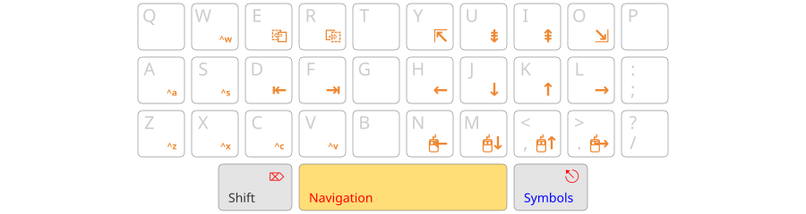
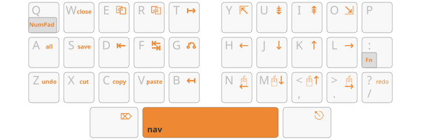
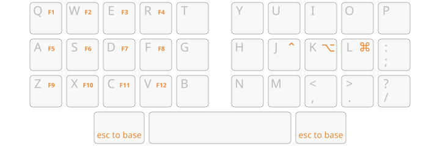

<h1 align="center">Arsenik</h1>

  ★ <strong>Ergonomics for any keyboard!</strong> ★

 

  Configure your keyboard — even if it is not programmable — with a
  beginner-friendly approach to minimize finger movements!

 

*Note: The keyboard layout presented here in the illustration is Qwerty but it
works with other layouts as well — Azerty, Qwertz, Ergo‑L, Bépo…*

--------------------------------------------------------------------------------

Table of contents
--------------------------------------------------------------------------------

- [Philosophy](#philosophy)
- [Features](#pick-your-poison)
  1. [Angle mod](#1-angle-mod)
  2. [Mod-taps](#2-supercharge-your-thumbs-with-mod-taps)
  3. [Symbols layer](#3-symbols-layer)
  4. [Navigation layer](#4-navigation-layer)
  5. [Keyboard layout](#5-keyboard-layout)
  6. [Extra customization](#bonus-spice-it-up)
- [Installation](#installation)
- [Why “Arsenik”?](#why-arsenik)

Philosophy
--------------------------------------------------------------------------------

**Bring the keys to your fingers, rather than moving your fingers to the keys.**

Not sure if you should buy that expensive ergonomic keyboard?

Download a ready-to-use Arsenik configuration for [Kanata], and enjoy your
regular features that were normally only accessible to a programmable
keyboard.

*Note: You probably will benefit the most of Arsenik if you are [touch typing].*

Pick Your Poison!
--------------------------------------------------------------------------------

Choose which Arsenik features to use from the following options:

### 1. Angle mod

On an ISO keyboard, it permutes the extra down-left key to ease the angle on
your left wrist when typing.

### 2. Supercharge your thumbs with mod-taps

#### First: layer-taps

If you’re new to mod-taps, we suggest to start by adding the “layer-tap” option
where only the thumbs are affected:

- the left thumb key remains a <kbd>Cmd</kbd> or <kbd>Alt</kbd> key when held,
but emits a <kbd>Backspace</kbd> when tapped;
- the right thumb key brings the <kbd>Symbols</kbd> layer when held (in blue)
— where all programming symbols are arranged for comfort and efficiency — and
emits <kbd>Return</kbd> when tapped;
- the spacebar brings the <kbd>Navigation</kbd> layer when held (in orange).

Having <kbd>Backspace</kbd> and <kbd>Enter</kbd> under the thumbs is enough to
reduce pinky fatigue very significantly. And using the <kbd>Symbols</kbd>
and <kbd>Navigation</kbd> layers further reduces hand and finger movements.

#### Next level: enable the Home Row Mods

When you are familiar with mod-taps, it’s time to enable them on the home row
with the “HRM” variants:

- <kbd>FDS</kbd> and <kbd>JKL</kbd> become <kbd>Alt</kbd>, <kbd>Ctrl</kbd>,
<kbd>Super</kbd> when held long enough;
- the left thumb key can now emit a <kbd>Shift</kbd> rather than <kbd>Alt</kbd>
when held.

This is a very basic variant of the [Miryoku] principle: one layer on each
thumb key, and symmetrical modifiers on the home row.

### 3. Symbols layer

For the <kbd>Symbols</kbd> layer you can keep <kbd>AltGr</kbd> as-is. It is
useful for keyboard layouts that rely heavily on the <kbd>AltGr</kbd> key.

But the real fun (especially for programmers) happens when we enable the
“Lafayette” programming layer!

#### Num row >> Num pad

If enabled, in <kbd>Symbols</kbd> mode, pressing the left thumb key brings up
the <kbd>NumRow</kbd> layer:

- all digits are on the home row, in the order you already know;
- the upper row helps with <kbd>Shift</kbd>-digit shortcuts;
- the lower row has dash, comma, dot and slash signs to help with number/date
inputs
- <kbd>Space</kbd> becomes a narrow no-break space for layouts that support it.

Even on keyboards that *do* have a physical number row, this `NumRow` layer can
be interesting to use in order to further minimize finger movements.

### 4. Navigation layer

A basic <kbd>Navigation</kbd> layer has an arrow cluster on the left hand to
move around and a num pad on the right hand.

#### Vim Variant

For those who like to move the cursor with <kbd>HJKL</kbd> in all apps with any
keyboard layout, it is possible to enable a Vim-like <kbd>Navigation</kbd>
layer.

It also has:

- super-comfortable <kbd>Tab</kbd> and <kbd>Shift</kbd>-<kbd>Tab</kbd>
- mouse emulation: previous/next and mouse scroll

This <kbd>Navigation</kbd> layer has a few empty slots on purpose, so you can
add your own keys or layers.

<kbd>NumPad</kbd> and <kbd>Fn</kbd> lock these layers: they remain active
without holding the key until escaped with <kbd>Alt</kbd> or <kbd>AltGr</kbd>.

  <em>NumPad layer toggled</em>

  <em>Fn layer toggled</em>

### 5. Keyboard layout

Choose your keyboard layout among the available ones for Arsenik to work
properly.

If your layout is not on this list, feel free to open an issue or upvote an
existing one.

Here are some caveats for specific layouts:

QWERTY/Colemak

Qwerty and Colemak work out-of-the-box with the Lafayette <kbd>Symbols</kbd> layer
because there are no other characters typed with <kbd>AltGr</kbd>.

Ergo‑L/QWERTY‑Lafayette/other Lafayette layouts

Arsenik works out-of-the-box with Lafayette layouts because their
<kbd>AltGr</kbd> layer already matches Arsenik’s <kbd>Symbols</kbd> layer.

AZERTY

By using the Lafayette <kbd>Symbols</kbd> layer, you won’t have access to the
<kbd>€</kbd> sign with <kbd>AltGr</kbd>. You might want to remap it elsewhere, or
avoid using the Lafayette <kbd>Symbols</kbd> layer.

Bépo

By using the Lafayette <kbd>Symbols</kbd> layer, you won’t have access to the
characters typed with <kbd>AltGr</kbd>. You might want to remap some of them elsewhere,
or avoid using the Lafayette <kbd>Symbols</kbd> layer.

### Bonus: Spice It Up

From there, you can edit the configuration to your liking, and even contribute
to Arsenik!

The 300 ms delay before a key becomes a modifier has been chosen to be easy for
beginners. Once used to mod-taps, you may want to reduce it so keyboard
shortcuts can be done more quickly.

In the <kbd>NumRow</kbd> layer, you can edit the <kbd>dk1</kbd> to
<kbd>dk5</kbd> shortcuts to put whatever seems useful to you: the numerous available
keys are defined in the [Kanata source code][Kanata keys].

Note that Kanata can also use the laptop’s trackpoint buttons (e.g. on a ThinkPad)
as two additional thumb keys. :-)

Installation
--------------------------------------------------------------------------------

- [Ækeynox-kanata] for non-programmable keyboards
- [Ækeynox-QMK] for QMK keyboards
- [Ækeynox-ZMK] for ZMK keyboards

[Ækeynox-kanata]: https://github.com/OneDeadKey/kanata-config-aekeynox
[Ækeynox-QMK]:    https://github.com/OneDeadKey/qmk-config-aekeynox
[Ækeynox-ZMK]:    https://github.com/OneDeadKey/zmk-config-aekeynox

### Non-Programmable Keyboards

Arsenik can be installed as a configuration for your PC or Mac with
[Ækeynox-kanata] (Windows, macOS, Linux). We recommend using:

- the angle-mod for laptop keyboards with a short spacebar (5u);
- the wide angle-mod for desktop keyboards with a long spacebar (6.25u or more).

This implementation used to be developed in this repository, but it’s been fully
refactored, and it now lives in its own repository.

[Ækeynox-kanata] is the easiest way to adjust to compact keyboard layouts. It’s
designed for a step-by-step approach, where every feature can be enabled one by
one, until home row mods are finally mastered.

Kanata has been favored because for its features and active development, but
other desktop implementations would be nice to see as well: KMonad, keyd,
Karabiner….

### Programmable Keyboards

Arsenik can be installed on most programmable keyboards:

- either “as is” on ANSI/ISO keyboards, or on ergonomic keyboards with a central
  space bar (Planck, Preonic, Reviung…);
- or with the [Selenium] variant, for split keyboards with at least two keys
  per thumb.

There are two implementations, [Ækeynox-QMK] and [Ækeynox-ZMK], for QMK and ZMK
keyboards, respectively. Both are actively maintained.

Why “Arsenik”?
--------------------------------------------------------------------------------

33 keys layout: the 33rd element of the periodic table.

Unlike Miryoku, which requires 6 thumb keys, Arsenik has been designed to work
with standard ANSI/ISO/laptop keyboards, leveraging the spacebar and the two
Alt/Cmd keys.

### Inspiration

- [Miryoku] for the main idea of using modifiers on the home row and layer
shifters under the thumbs
- [Lafayette] and [Ergo-L] for the <kbd>Symbols</kbd> layer, which has been
shamelessly taken *as is*
- [Extend], [Neo], [Shaka34] for the <kbd>Navigation</kbd> layer

### Alternative Symbols Layers

- [Neo]
- [Seniply]
- [Pascal Getreuer’s]

### Similar Projects

- [Miryoku]: 36 keys, 6 layers, <kbd>Shift</kbd> as home row mod
- [Seniply]: 34 keys, 6 layers, no layer-taps (“Callum-style”)
- [Selenium]: 34 keys, an Arsenik variant for split keyboards

[Kanata]: https://github.com/jtroo/kanata
[Miryoku]: https://github.com/manna-harbour/miryoku
[touch typing]: https://en.wikipedia.org/wiki/Touch_typing
[Lafayette]: https://qwerty-lafayette.org/
[Ergo-L]: https://ergol.org
[Kanata keys]: https://github.com/jtroo/kanata/blob/main/parser/src/keys/mod.rs#L159
[Extend]: https://dreymar.colemak.org/layers-extend.html
[Neo]: https://neo-layout.org
[Shaka34]: https://github.com/lobre/shaka34
[Seniply]: https://stevep99.github.io/seniply/
[Pascal Getreuer’s]: https://getreuer.info/posts/keyboards/symbol-layer/#my-symbol-layer
[Selenium]: https://onedeadkey.github.io/selenium/
