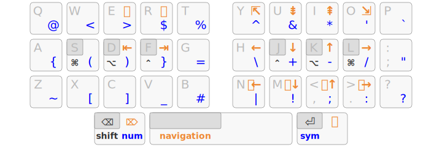

Arsenik
================================================================================

A beginner-friendly, [Miryoku][1]-like approach to minimize finger movements:

- 3 home-row mods per hand for <kbd>Ctrl</kbd>, <kbd>Alt</kbd>, <kbd>Super</kbd>
- 3 layer-tap keys under the thumbs: <kbd>Shift</kbd>/<kbd>Backspace</kbd>,
<kbd>Navigation</kbd>/<kbd>Space</kbd>, <kbd>Symbol</kbd>/<kbd>Return</kbd>


**Bring the keys to your fingers, rather than moving your fingers to the keys!**

- A long press on the <kbd>Return</kbd> key brings up the <kbd>Symbol</kbd>
layer, where all programming symbols are arranged for comfort and efficiency,
Dvorak-like.
- A long press on the <kbd>Space</kbd> bar brings up the <kbd>Navigation</kbd>
layer, with a numpad, cursor navigation (<kbd>ESDF</kbd>) and one-hand shortcuts.

This is how modern ergonomic keyboards work — e.g. [Planck][47], [Atreus][44],
[Corne][42], [Ferris][34]… The goal here is to propose an approach that works
with any keyboard, including your laptop’s.

[47]: https://olkb.com/collections/planck
[44]: https://atreus.technomancy.us
[42]: https://github.com/foostan/crkbd
[34]: https://github.com/pierrechevalier83/ferris


Main Benefits
--------------------------------------------------------------------------------

- <kbd>Shift</kbd>, <kbd>Backspace</kbd>, <kbd>Return</kbd> under the thumbs!
- all numbers and programming symbols in the comfortable 3×10 zone
- symmetrical modifiers on the home row
- easier left-hand shortcuts
- works with any keyboard

Unlike Miryoku which requires 6 thumb keys, Arsenik has been designed to work
with standard ANSI/ISO/laptop keyboards, leveraging the spacebar and the two
Alt/Cmd keys.


Pick Your Poison!
--------------------------------------------------------------------------------

Adjusting to compact keyboard layouts isn’t easy, but Arsenik is designed for
a step-by-step approach.

### 1. Supercharge Your Thumbs

If you’re new to mod-taps, we suggest to start with the “easy” variants where
only the thumbs are affected:

- the left thumb key remains a <kbd>Cmd</kbd> or <kbd>Alt</kbd> key when hold,
but emits a <kbd>Backspace</kbd> when tapped;
- the right thumb key brings the <kbd>Symbols</kbd> layer when hold (similar to
an <kbd>AltGr</kbd> key), and emits <kbd>Return</kbd> when tapped;
- the spacebar brings the <kbd>Navigation</kbd> layer when hold.


Having <kbd>Backspace</kbd> and <kbd>Enter</kbd> under the thumbs is enough to
reduce the pinky fatigue very significantly. And using the <kbd>Symbol</kbd>
and <kbd>Navigation</kbd> layer further reduces hand and finger movements.

### 2. Enable the Home-Row Mods

When you are familiar with mod-taps, it’s time to enable them on the homerow
with the “hrm” variants:

- <kbd>FDS</kbd> and <kbd>JKL</kbd> become <kbd>Ctrl</kbd>, <kbd>Alt</kbd>,
<kbd>Super</kbd> when hold long enough;
- the left thumb key can now emit a <kbd>Shift</kbd> rather than <kbd>Alt</kbd>
wen hold.


This is a very basic variant of the [Miryoku][1] principle: one layer on each
thumb key, and symmetrical modifiers on the homerow.

### 3. Spice It Up

- the 300 ms delay before a key becomes a modifier has been chosen to be easy
for beginners. Once used to mod-taps, you may want to reduce it so keyboard
shortcuts can be done more quickly;
- adding new layers should be easy, even without additional thumb keys — check
[the Selenium33 mod][11] to get some ideas.


Downloads
--------------------------------------------------------------------------------

[Non-programmable keyboards are supported through kanata.](kanata)

Other desktop implementations (kmonad, keyd…) would be nice to see as well.

Programmable keyboards should be trivial to configure with QMK, ZMK,
Kaleidoscope, etc.


Related Projects
--------------------------------------------------------------------------------

### Inspiration

- [Miryoku][1] for the main idea of using modifiers on the homerow and layer
shifters under the thumbs;
- [Lafayette][2] and [Ergo-L][3] for the <kbd>Symbol</kbd> layer, which has been
blatantly taken *as is*;
- [Extend][4], [Neo][5], [Shaka34][6] for the <kbd>Navigation</kbd> layer.

### Alternative Symbol Layers

- [Neo][5]
- [Seniply][7]
- [Pascal Getreuer’s][8]

### Non-Goals

- being the most efficient 3×5 layout — [Miryoku][1] is probably the most
advanced approach for that, at least on custom 36-key keyboards;
- fitting any OS layout — Arsenik works best if your OS layout has either no
AltGr layer at all (e.g. QWERTY, Colemak, Workman…), or an optimized AltGr layer
([Lafayette][2], [Ergo-L][3]…).

### Similar Projects

- [Miryoku][1]: 36 keys, 6 layers
- [Seniply][7]: 34 keys, 6 layers, no layer-taps (“Callum-style”)
- [Selenium33][11]: 33 keys, 4 layers — a Vim-friendly Arsenik mod

<!-- https://jasoncarloscox.com/writing/combo-mods/ -->

[1]: https://github.com/manna-harbour/miryoku
[2]: https://qwerty-lafayette.org/42
[3]: https://ergol.org
[4]: https://dreymar.colemak.org/layers-extend.html
[5]: https://neo-layout.org
[6]: https://github.com/lobre/shaka34
[7]: https://stevep99.github.io/seniply/
[8]: https://getreuer.info/posts/keyboards/symbol-layer/#my-symbol-layer
[11]: mods/selenium33


TODO
--------------------------------------------------------------------------------

- angle mods!
- KMonad / Karabiner support
- sample QMK / ZMK implementations for common keyboards
- variants for specific OS layouts


kanata
================================================================================


Pick Your Poison!
--------------------------------------------------------------------------------

| type  | without homerow-mods        | with homerow-mods          | suitable layouts                  |
| ----- | --------------------------- | -------------------------- | --------------------------------- |
| ANSI  | [arsenik_easy_ansi.kbd][1]  | [arsenik_hrm_ansi.kbd][3]  | QWERTY, Dvorak, Colemak, Workman… |
| AltGr | [arsenik_easy_altgr.kbd][2] | [arsenik_hrm_altgr.kbd][4] | [Lafayette42][10], [Ergo-L][11]…  |

[1]: arsenik_easy_ansi.kbd
[2]: arsenik_easy_altgr.kbd
[3]: arsenik_hrm_ansi.kbd
[4]: arsenik_hrm_altgr.kbd

- “Easy” variants don’t use any homerow-mods and leave the left thumb key
modifier unchanged — but they still use a <kbd>Prog</kbd> layer and put the
<kbd>Backspace</kbd> and <kbd>Return</kbd> keys under the thumbs. A good
starting point if you’re new to dual keys.
- ANSI variants assume all symbols in your keyboard layout are in their
QWERTY-ANSI positions: works fine with most US layouts but Dvorak users will get
a slightly different <kbd>Prog</kbd> layer.
- AltGr variants use your layout’s AltGr layer instead of the <kbd>Prog</kbd>
layer: perfect for layouts that already have an optimized AltGr layer, such as
[QWERTY-Lafayette][10] and [Ergo-L][11].

[10]: https://qwerty-lafayette.org/42
[11]: https://ergol.org

Note that kanata can also use the laptop’s trackpoint buttons (e.g. ThinkPad)
as two additional thumb keys. :-)


Installation
--------------------------------------------------------------------------------

You can install `kanata` by either downloading a [pre-built
executable](https://github.com/jtroo/kanata/releases), or by running the
following commands (if you have `rustc` installed):

```bash
rustup update stable
cargo install kanata
```

Linux users may want to run these extra steps:

<details>
<summary> Running kanata without `sudo` </summary>

kanata needs to intercept `uinput` signals, which it cannot do without the
proper authorisations.

If you don’t want to run `kanata` with `sudo`, you’ll need to allow `kanata` to
read from `uinput`. This requires the users to be part of both `input` and
`uinput` groups.

For that, you first need to create a `uinput` group if it is not the case yet:

```bash
sudo groupadd -U $USERNAME uinput
```

Where `$USERNAME` is the target user (or users in a comma separated list), and
add the target user (or users) to the group input:

```bash
sudo usermod -aG input $USERNAME
```

You can then check after relogin that both groups appear in the result of the
`groups` command launched as the target user.

Finally, you need to add a udev rule in `/etc/udev/rules.d/50-kanata.rules`:

```udev
KERNEL=="uinput", MODE="0660", GROUP="uinput", OPTIONS+="static_node=uinput"
```
</details>

<details>
<summary> Making a user-side systemd service for kanata </summary>

Note: This only works if `kanata` is able to run without `sudo` (and are using
`systemd`).

Using a `systemd service` allows running `kanata` as a daemon, possibly right
after logging in. Here is a template for a service file:

```
[Unit]
Description=Kanata keyboard remapper
Documentation=https://github.com/jtroo/kanata

[Service]
Environment=PATH=/usr/local/bin:/usr/local/sbin:/usr/bin:/bin
Environment=DISPLAY=:0
Environment=HOME=/path/to/home/folder
Type=simple
ExecStart=/usr/local/bin/kanata --cfg /path/to/kanata/config/file
Restart=no

[Install]
WantedBy=default.target
```

Copy-paste it into `~/.config/systemd/user/kanata.service`, fill in the
placeholders, then run one of the following commands:

- `systemctl --user start kanata.service` to manually start `kanata`
- `systemctl --user enable kanata.service` so `kanata` may autostart whenever the current user logs in
- `systemctl --user status kanata.service` to check if `kanata` is running

</details>


An experiment to modularize Arsenik and bring more features, e.g.
angle mods, Vim-like navigation layer, Mac/Azerty/Qwertz support, etc.

- load `kanata.kbd`
- enable each feature by un-commenting the related line
- live-reload the configuration with Space+Backspace (requires layer-taps)

Configuration options:

- key arrangement: Mac or PC, with or without angle mod?
- base layer: standard, layer-taps, homerow mods?
- symbols layer: AltGr, QWERTY, QWERTZ, AZERTY?
- navigation layer: ESDF or HJKL?

This should work exactly like Arsenik by default, except Escape and Enter have
been swapped.


Selenium33
================================================================================

A Vim-friendly Arsenik mod:

- 3 home-row mods per hand for <kbd>Ctrl</kbd>, <kbd>Alt</kbd>, <kbd>Super</kbd>
- 3 layer-tap keys under the thumbs: <kbd>Shift</kbd>/<kbd>Backspace</kbd>,
<kbd>Navigation</kbd>/<kbd>Space</kbd>, <kbd>Symbol</kbd>/<kbd>Return</kbd>



Selenium uses 4 layers (instead of 3 for Arsenik), which makes it a natural fit
for 34-key keyboards like the [Ferris][34].

[34]: https://github.com/pierrechevalier83/ferris


Extended Navigation
--------------------------------------------------------------------------------

- Vim-like navigation in all apps, with any OS layout
- super-comfortable <kbd>Tab</kbd> and <kbd>Shift</kbd>-<kbd>Tab</kbd>
- mouse emulation: previous / next and mouse scroll
- easy left-hand shortcuts


This <kbd>Navigation</kbd> layer has a few empty slots on purpose, so you can
add our own keys or layers.


NumRow >> NumPad
--------------------------------------------------------------------------------

In <kbd>Symbol</kbd> mode, pressing the left thumb key brings up the
<kbd>NumRow</kbd> layer:

- all digits are on the home row, in the order you already know
- the upper row helps with <kbd>Shift</kbd>-digit shortcuts
- the lower row has dash, comma, dot and slash signs to help with number / date
inputs


Even on keyboards that *do* have a physical number row, this <kbd>NumRow</kbd>
layer can be interesting to use in order to minimize finger movements further
more. And it makes it easier to mix symbols with numbers (e.g. `[0]`).


Implementations
--------------------------------------------------------------------------------

### QMK

The QMK implementation is a bit different:

- it takes advantage of the 4 thumb keys
- the Navigation layer uses a mouse emulation on the left hand

In fact, this is what I ended up with for my beloved Ferris in the first place,
and Arsenik/Selenium is an attempt to fit most of this magic into my laptop keyboard.


```bash
# from the `qmk_firmware` root:
make ferris/0_2/bling:1dk:flash
```

