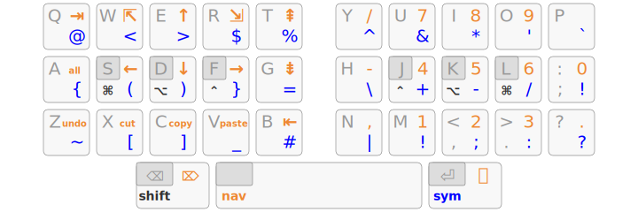

Arsenik
================================================================================

A basic [Miryoku][1]-like approach to minimize finger movements:

- 3 home-row mods per hand for <kbd>Ctrl</kbd>, <kbd>Alt</kbd>, <kbd>Super</kbd>
- 3 layer-tap keys under the thumbs: <kbd>Shift</kbd>/<kbd>Backspace</kbd>,
<kbd>Navigation</kbd>/<kbd>Space</kbd>, <kbd>Symbol</kbd>/<kbd>Return</kbd>

**Bring the keys to your fingers, rather than moving your fingers to the keys!**

- A long press on the <kbd>Return</kbd> key brings up the <kbd>Symbol</kbd>
layer, where all programming symbols are arranged for comfort and efficiency,
Dvorak-like.
- A long press on the <kbd>Space</kbd> bar brings up the <kbd>Navigation</kbd>
layer, with easy one-hand shortcuts (<kbd>Ctrl</kbd>-<kbd>WASZXCV</kbd>),
Vim-like navigation (<kbd>HJKL</kbd>) and more…

This is how modern ergonomic keyboards work — e.g. [Planck][47], [Atreus][44],
[Corne][42], [Ferris][34]… The goal here is to propose an approach that works
with any keyboard, including your laptop’s.

[47]: https://olkb.com/collections/planck
[44]: https://atreus.technomancy.us
[42]: https://github.com/foostan/crkbd
[34]: https://github.com/pierrechevalier83/ferris

Main Benefits
--------------------------------------------------------------------------------

- <kbd>Shift</kbd>, <kbd>Backspace</kbd>, <kbd>Return</kbd> under the thumbs!
- all programming symbols in the comfortable 3×10 zone
- symmetrical modifiers on the home row
- Vim-like navigation in all apps
- easier left-hand shortcuts
- works with any keyboard

Using Arsenik
--------------------------------------------------------------------------------

Unlike Miryoku which requires 6 thumb keys, Arsenik has been designed to work
with standard ANSI/ISO/laptop keyboards, leveraging the spacebar and the two
Alt/Cmd keys.

[Non-programmable keyboards are supported through kanata.](kanata)

Programmable keyboards should be trivial to configure with QMK, ZMK,
Kaleidoscope, etc.

No numbers? No problem.
--------------------------------------------------------------------------------

If your keyboard has no number row, we got you covered! In <kbd>Symbol</kbd>
mode, pressing the left thumb key brings up the <kbd>NumRow</kbd> layer:

- all digits are on the home row, in the order you already know
- the upper row helps with <kbd>Shift</kbd>-digit shortcuts
- the lower row has dash, comma, dot and slash signs to help with number / date
inputs

Even on keyboards that *do* have a number row, this <kbd>NumRow</kbd> layer can
be interesting to use in order to minimize finger movements a bit more.

Related Projects
--------------------------------------------------------------------------------

### Inspiration

- [Miryoku][1] for the main idea of using modifiers on the homerow and layer
shifters under the thumbs;
- [Lafayette][2] and [Ergo-L][3] for the <kbd>Symbol</kbd> layer, which has been
blatantly taken *as is*.

### Alternatives

- [Extend][4] for the <kbd>Navigation</kbd> layer
- [Neo][5] for the <kbd>Navigation</kbd> and <kbd>Symbol</kbd> layers
- [Pascal Getreuer][6] for the <kbd>Symbol</kbd> layer

### Non-Goals

- being the most efficient 3×5 layout — [Miryoku][1] is probably the most
advanced approach for that, at least on custom 36-key keyboards;
- being the most intuitive 3×5 layout — [Neo][5]’s navigation-and-numpad layer
would be an easier alternative, but a more Vim-like approach has been preferred;
- fitting any OS layout — Arsenik works best if your OS layout has either no
AltGr layer at all (e.g. QWERTY, Colemak, Workman…), or an optimized AltGr layer
([Lafayette][2], [Ergo-L][3]…).

[1]: https://github.com/manna-harbour/miryoku
[2]: https://qwerty-lafayette.org/42
[3]: https://ergol.org
[4]: https://dreymar.colemak.org/layers-extend.html
[5]: https://www.neo-layout.org/
[6]: https://getreuer.info/posts/keyboards/symbol-layer/

TODO
--------------------------------------------------------------------------------

- NumPad layer?
- angle mods!
- KMonad / Karabiner support
- sample QMK / ZMK implementations for common keyboards
- variants for specific OS layouts
