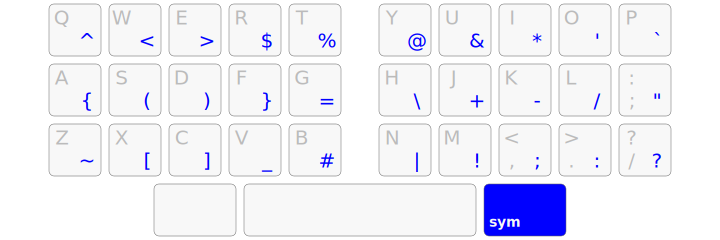
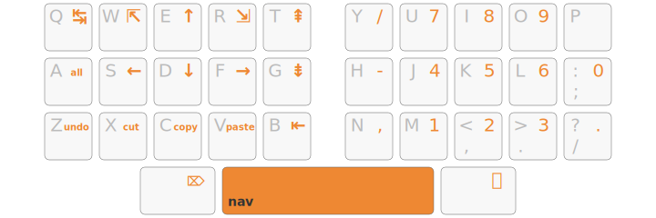

<h1 align="center">Arsenik</h1>

  ★ <strong>Ergonomics for any keyboard!</strong> ★

 

  Configure your keyboard — even if it is not programmable — with a
  beginner-friendly approach to minimize finger movements!

 

*Note: The keyboard layout presented here in the illustration is Qwerty but it
works with other layouts as well — Azerty, Qwertz, Ergo‑L, Bépo…*

--------------------------------------------------------------------------------

Table of contents
--------------------------------------------------------------------------------

- [Philosophy](#philosophy)
- [Features](#pick-your-poison)
  1. [Angle mod](#1-angle-mod)
  2. [Mod-taps](#2-supercharge-your-thumbs-with-mod-taps)
  3. [Symbols layer](#3-symbols-layer)
  4. [Navigation layer](#4-navigation-layer)
  5. [Keyboard layout](#5-keyboard-layout)
  6. [Extra customization](#bonus-spice-it-up)
- [Installation](#installation)
- [Troubleshooting](#troubleshooting)
- [Why “Arsenik”?](#why-arsenik)
- [Join the community](#join-the-community)

Philosophy
--------------------------------------------------------------------------------

**Bring the keys to your fingers, rather than moving your fingers to the keys.**

Not sure if you should buy that expensive ergonomic keyboard?

Download a ready-to-use Arsenik configuration for [Kanata], and enjoy your
regular features that were normally only accessible to a programmable
keyboard.

*Note: You probably will benefit the most of Arsenik if you are [touch typing].*

Pick Your Poison!
--------------------------------------------------------------------------------

Choose which Arsenik features to use from the following options:

### 1. Angle mod

On an ISO keyboard, it permutes the extra down-left key to ease the angle on
your left wrist when typing.

### 2. Supercharge your thumbs with mod-taps

#### First: layer-taps

If you’re new to mod-taps, we suggest to start by adding the “layer-tap” option
where only the thumbs are affected:

- the left thumb key remains a <kbd>Cmd</kbd> or <kbd>Alt</kbd> key when held,
but emits a <kbd>Backspace</kbd> when tapped;
- the right thumb key brings the <kbd>Symbols</kbd> layer when held (in blue)
— where all programming symbols are arranged for comfort and efficiency — and
emits <kbd>Return</kbd> when tapped;
- the spacebar brings the <kbd>Navigation</kbd> layer when held (in orange).

Having <kbd>Backspace</kbd> and <kbd>Enter</kbd> under the thumbs is enough to
reduce pinky fatigue very significantly. And using the <kbd>Symbols</kbd>
and <kbd>Navigation</kbd> layers further reduces hand and finger movements.

#### Next level: enable the Home Row Mods

When you are familiar with mod-taps, it’s time to enable them on the home row
with the “HRM” variants:

- <kbd>FDS</kbd> and <kbd>JKL</kbd> become <kbd>Alt</kbd>, <kbd>Ctrl</kbd>,
<kbd>Super</kbd> when held long enough;
- the left thumb key can now emit a <kbd>Shift</kbd> rather than <kbd>Alt</kbd>
when held.

This is a very basic variant of the [Miryoku] principle: one layer on each
thumb key, and symmetrical modifiers on the home row.

### 3. Symbols layer

For the <kbd>Symbols</kbd> layer you can keep <kbd>AltGr</kbd> as-is. It is
useful for keyboard layouts that rely heavily on the <kbd>AltGr</kbd> key.

But the real fun (especially for programmers) happens when we enable the
“Lafayette” programming layer!

#### Num row >> Num pad

If enabled, in <kbd>Symbols</kbd> mode, pressing the left thumb key brings up
the <kbd>NumRow</kbd> layer:

- all digits are on the home row, in the order you already know;
- the upper row helps with <kbd>Shift</kbd>-digit shortcuts;
- the lower row has dash, comma, dot and slash signs to help with number/date
inputs
- <kbd>Space</kbd> becomes a narrow no-break space for layouts that support it.

Even on keyboards that *do* have a physical number row, this `NumRow` layer can
be interesting to use in order to further minimize finger movements.

### 4. Navigation layer

A basic <kbd>Navigation</kbd> layer has an arrow cluster on the left hand to
move around and a num pad on the right hand.

#### A superpowered Vim-friendly mod

For those who like to move the cursor with <kbd>HJKL</kbd> in all apps with any
keyboard layout, it is possible to enable a Vim-like <kbd>Navigation</kbd>
layer.

It also has:

- super-comfortable <kbd>Tab</kbd> and <kbd>Shift</kbd>-<kbd>Tab</kbd>
- mouse emulation: previous/next and mouse scroll

This <kbd>Navigation</kbd> layer has a few empty slots on purpose, so you can
add your own keys or layers.

<kbd>NumPad</kbd> and <kbd>Fn</kbd> lock these layers: they remain active
without holding the key until escaped with <kbd>Alt</kbd> or <kbd>AltGr</kbd>.

  <em>NumPad layer toggled</em>

  <em>Fn layer toggled</em>

### 5. Keyboard layout

Choose your keyboard layout among the available ones for Arsenik to work
properly.

If your layout is not on this list, feel free to open an issue or upvote an
existing one.

Here are some caveats for specific layouts:

Ergo‑L/Qwerty‑Lafayette/other Lafayette layouts

Arsenik works out-of-the-box with Lafayette layouts because their
<kbd>AltGr</kbd> layer already matches Arsenik’s <kbd>Symbols</kbd> layer.

Qwerty/Colemak

Qwerty and Colemak work out-of-the-box with the Lafayette <kbd>Symbols</kbd> layer
because there are no other characters typed with <kbd>AltGr</kbd>.

Azerty

By using the Lafayette <kbd>Symbols</kbd> layer, you won’t have access to the
<kbd>€</kbd> sign with <kbd>AltGr</kbd>. You might want to remap it elsewhere, or
avoid using the Lafayette <kbd>Symbols</kbd> layer.

Bépo

By using the Lafayette <kbd>Symbols</kbd> layer, you won’t have access to the
characters typed with <kbd>AltGr</kbd>. You might want to remap some of them elsewhere,
or avoid using the Lafayette <kbd>Symbols</kbd> layer.

Optimot

Do not enable angle mod for Optimot as its driver already implements angle mod.

By using the Lafayette <kbd>Symbols</kbd> layer, you won’t have access to the
characters typed with <kbd>AltGr</kbd>. You might want to remap some of them elsewhere,
or avoid using the Lafayette <kbd>Symbols</kbd> layer.

### Bonus: Spice It Up

From there, you can edit the configuration to your liking, and even contribute
to Arsenik!

The 300 ms delay before a key becomes a modifier has been chosen to be easy for
beginners. Once used to mod-taps, you may want to reduce it so keyboard
shortcuts can be done more quickly.

In the <kbd>NumRow</kbd> layer, you can edit the <kbd>dk1</kbd> to
<kbd>dk5</kbd> shortcuts to put whatever seems useful to you: the numerous available
keys are defined in the [Kanata source code][Kanata keys].

In the <kbd>Navigation</kbd> layer, you can put a command on top of the (Qwerty)
<kbd>P</kbd> key, e.g. for an application launcher.

Note that Kanata can also use the laptop’s trackpoint buttons (e.g. on a ThinkPad)
as two additional thumb keys. :-)

Installation
--------------------------------------------------------------------------------

Adjusting to compact keyboard layouts isn’t easy, but Arsenik is designed for
a step-by-step approach:

- load `kanata.kbd` with Kanata ([installation instructions](kanata));
- enable each feature by un-commenting the related line (a commented line starts
with `;;`) – you must enable one and only one line per feature;
- live-reload the configuration with <kbd>Space</kbd>+<kbd>Backspace</kbd>
(this requires the layer-taps feature enabled).

If you have a programmable keyboard you might want to take a look at the
[QMK](qmk) version of Arsenik (work in progress).

Other desktop implementations (KMonad, keyd, Karabiner…) would be nice to see as
well.

Troubleshooting
--------------------------------------------------------------------------------

Some combinations of three keys might not work on a standard keyboard, due to
[ghosting], which is a hardware problem that Kanata cannot fix. If you have this
problem, you have to release a key to be able to press another one.

Why “Arsenik”?
--------------------------------------------------------------------------------

33 keys layout: the 33rd element of the periodic table.

Unlike Miryoku, which requires 6 thumb keys, Arsenik has been designed to work
with standard ANSI/ISO/laptop keyboards, leveraging the spacebar and the two
Alt/Cmd keys.

### Inspiration

- [Miryoku] for the main idea of using modifiers on the home row and layer
shifters under the thumbs
- [Lafayette] and [Ergo-L] for the <kbd>Symbols</kbd> layer, which has been
shamelessly taken *as is*
- [Extend], [Neo], [Shaka34] for the <kbd>Navigation</kbd> layer

### Alternative Symbols Layers

- [Neo]
- [Seniply]
- [Pascal Getreuer’s]

### Non-Goals

- Being the most efficient 3×5 layout — [Miryoku] is probably the most
advanced approach for that, at least on custom 36-key keyboards
- Suiting every user out-of-the-box — Arsenik is proposed as a reasonable
default configuration, but users are encouraged to customize it to suit their
personal needs and preferences
- Fitting any OS layout — Arsenik works best if your OS layout has either no
AltGr layer at all (e.g. Qwerty, Colemak, Workman…) or an optimized AltGr layer
([Lafayette], [Ergo-L]…)

### Similar Projects

- [Miryoku]: 36 keys, 6 layers
- [Seniply]: 34 keys, 6 layers, no layer-taps (“Callum-style”)

Join the community
--------------------------------------------------------------------------------

French-speaking users may join the [Ergo-L Discord server], which hosts a
channel to talk about Arsenik, keyboards, layouts and much more.

Feel free to open an issue and/or a pull request if you encounter a bug or want
to enhance the Arsenik experience!

[Kanata]: https://github.com/jtroo/kanata
[Miryoku]: https://github.com/manna-harbour/miryoku
[touch typing]: https://en.wikipedia.org/wiki/Touch_typing
[ghosting]: https://en.wikipedia.org/wiki/Key_rollover#Ghosting
[Lafayette]: https://qwerty-lafayette.org/42
[Ergo-L]: https://ergol.org
[Kanata keys]: https://github.com/jtroo/kanata/blob/main/parser/src/keys/mod.rs#L159
[Extend]: https://dreymar.colemak.org/layers-extend.html
[Neo]: https://neo-layout.org
[Shaka34]: https://github.com/lobre/shaka34
[Seniply]: https://stevep99.github.io/seniply/
[Pascal Getreuer’s]: https://getreuer.info/posts/keyboards/symbol-layer/#my-symbol-layer
[Ergo-L Discord server]: https://discord.gg/5xR5K3nAFX
