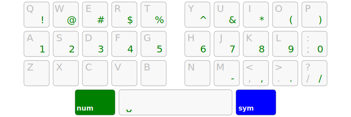
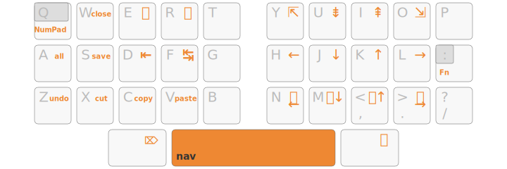
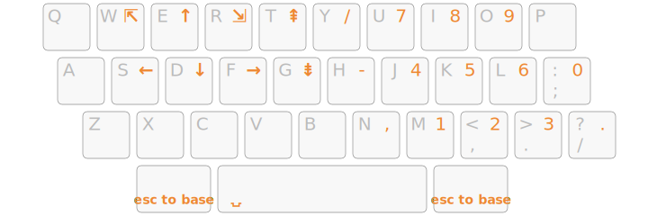
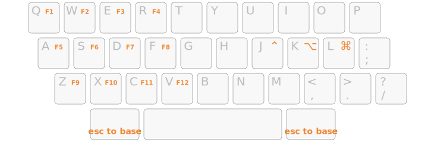

Arsenik Kanata
================================================================================


Installation
--------------------------------------------------------------------------------

- To get Arsenik, check out this repository with Git or [download it][1].
- Launch `kanata.kbd` with Kanata.
  - You can install Kanata by downloading a [pre-built executable][2].
  - Follow the installation details of your operating system.

<details>
<summary>Windows</summary>

Windows users might prefer to download the `kanata_winIOv2.exe` version as it
fixes some weird bugs like <kbd>C</kbd> and <kbd>V</kbd> inversion.

*Note: this tip is tested for the version 1.6.1 of Kanata, in later version the
`winIOv2` version might be the default one.*
</details>

<details>
<summary>Linux</summary>

### Run Kanata without <code>sudo</code>

kanata needs to intercept `uinput` signals, which it cannot do without the
proper authorisations.

If you don’t want to run `kanata` with `sudo`, you’ll need to allow Kanata to
read from `uinput`. This requires the users to be part of both `input` and
`uinput` groups.

For that, you first need to create a `uinput` group if it is not the case yet:

```bash
sudo groupadd -U $USERNAME uinput
```

Where `$USERNAME` is the target user (or users in a comma separated list), and
add the target user (or users) to the group input:

```bash
sudo usermod -aG input $USERNAME
```

You can then check after relogin that both groups appear in the result of the
`groups` command launched as the target user.

Finally, you need to add a udev rule in `/etc/udev/rules.d/50-kanata.rules`:

```udev
KERNEL=="uinput", MODE="0660", GROUP="uinput", OPTIONS+="static_node=uinput"
```


### Making a user-side systemd service for Kanata

Note: This only works if `kanata` is able to run without `sudo` (and is using
`systemd`).

Using a `systemd service` allows running `kanata` as a daemon, possibly right
after logging in. Here is a template for a service file:

```
[Unit]
Description=Kanata keyboard remapper
Documentation=https://github.com/jtroo/kanata

[Service]
Environment=PATH=/usr/local/bin:/usr/local/sbin:/usr/bin:/bin
Environment=DISPLAY=:0
Environment=HOME=/path/to/home/folder
Type=simple
ExecStart=/usr/local/bin/kanata --cfg /path/to/kanata/config/file
Restart=no

[Install]
WantedBy=default.target
```

Copy-paste it into `~/.config/systemd/user/kanata.service`, fill in the
placeholders, then run one of the following commands:

- `systemctl --user start kanata.service` to manually start `kanata`
- `systemctl --user enable kanata.service` so `kanata` may autostart whenever
the current user logs in
- `systemctl --user status kanata.service` to check if `kanata` is running
</details>


Pick Your Poison!
--------------------------------------------------------------------------------

Adjusting to compact keyboard layouts isn’t easy, but Arsenik is designed for
a step-by-step approach:

- load `kanata.kbd` with Kanata (installation instructions upward)
- enable each feature by un-commenting the related line (a commented line starts
with `;;`), you must enable one and only one line per feature
- live-reload the configuration with <kbd>Space</kbd>+<kbd>Backspace</kbd>
(requires the feature layer-taps enabled)


### 1. Angle mod

If you have an ISO keyboard, you might give a try to angle mod to ease the angle
on your left wrist when typing.

It permuts the extra ISO keyboard key on the down left of the keyboard,
illustrated by the following:


<p align="center">
  <em>No angle mod</em>
</p>


<p align="center">
  <em>With angle mod</em>
</p>

This option is enabled by default when you download Arsenik but can be disabled.


### 2. Supercharge your thumbs with mod-taps

#### First: layer-taps

If you’re new to mod-taps, we suggest to start by adding the “layer-tap” option
where only the thumbs are affected:

- the left thumb key remains a <kbd>Cmd</kbd> or <kbd>Alt</kbd> key when held,
but emits a <kbd>Backspace</kbd> when tapped;
- the right thumb key brings the <kbd>Symbols</kbd> layer when held (similar to
an <kbd>AltGr</kbd> key), and emits <kbd>Return</kbd> when tapped;
- the spacebar brings the <kbd>Navigation</kbd> layer when held.


Having <kbd>Backspace</kbd> and <kbd>Enter</kbd> under the thumbs is enough to
reduce the pinky fatigue very significantly. And using the <kbd>Symbol</kbd>
and <kbd>Navigation</kbd> layer further reduces hand and finger movements.


#### Next level: enable the Home Row Mods

When you are familiar with mod-taps, it’s time to enable them on the home row
with the “HRM” variants:

- <kbd>FDS</kbd> and <kbd>JKL</kbd> become <kbd>Ctrl</kbd>, <kbd>Alt</kbd>,
<kbd>Super</kbd> when held long enough;
- the left thumb key can now emit a <kbd>Shift</kbd> rather than <kbd>Alt</kbd>
when held.


This is a very basic variant of the [Miryoku][3] principle: one layer on each
thumb key, and symmetrical modifiers on the home row.


#### Spice it up

The 300 ms delay before a key becomes a modifier has been chosen to be easy for
beginners. Once used to mod-taps, you may want to reduce it so keyboard
shortcuts can be done more quickly.


### 3. Symbols layer

For the Symbols layer you can keep <kbd>AltGr</kbd> as-is. It is useful for
keyboard layouts that rely heavily on the <kbd>AltGr</kbd> key.

But the real fun (especially for programmers) happens when we enable the “One 
Dead Key” (= 1dk) programmation layer!


#### Num row >> Num pad

If enabled, in `Symbols` mode, pressing the left thumb key brings up the
`NumRow` layer:

- all digits are on the home row, in the order you already know
- the upper row helps with <kbd>Shift</kbd>-digit shortcuts
- the lower row has dash, comma, dot and slash signs to help with number / date
inputs
- <kbd>Space</kbd> becomes a narrow no-break space for layouts that supports it



Even on keyboards that *do* have a physical number row, this `NumRow`layer can
be interesting to use in order to minimize finger movements furthermore. And it
makes it easier to mix symbols with numbers (e.g. to type `[0]`).


### 4. Navigation layer

A basic `Navigation` layer has an arrow cluster on the left hand to move around
and a num pad on the right hand.


#### A superpowered Vim-friendly mod

For those who like to move the cursor with <kbd>HJKL</kbd> in all app, with any
keyboard layout, it is possible to enable a Vim-like `Navigation` layer.

It also has:
- super-comfortable <kbd>Tab</kbd> and <kbd>Shift</kbd>-<kbd>Tab</kbd>
- mouse emulation: previous / next and mouse scroll



This `Navigation` layer has a few empty slots on purpose, so you can add our own
keys or layers.

`NumPad` and `Fn` toggle these layers, they stay active without holding the key
until escaped with <kbd>Alt</kbd> or <kbd>AltGr</kbd>.


<p align="center">
  <em>NumPad layer toggled</em>
</p>


<p align="center">
  <em>Fn layer toggled</em>
</p>

### 5. Keyboard layout

Choose your keyboard layout among the available ones for Arsenik to work
properly.

If your layout is not on this list, feel free to open an issue or upvote an
existing one.

Here is some specifities for some supported layouts:

<details>
<summary>Azerty</summary>

By using the 1dk `Symbols` layer, you won’t have access to the <kbd>€</kbd> sign
in <kbd>AltGr</kbd>. You might want to remap it elsewhere, or not using the 1dk
`Symbols` layer.
</details>

<details>
<summary>Bépo</summary>

By using the 1dk `Symbols` layer, you won’t have access to the characters in
<kbd>AltGr</kbd>. You might want to remap some of them elsewhere, or not using
the 1dk `Symbols` layer.
</details>

<details>
<summary>Optimot</summary>

Do not enable angle mod for Optimot as it is already in angle mod with its
driver.

By using the 1dk `Symbols` layer, you won’t have access to the characters in
<kbd>AltGr</kbd>. You might want to remap some of them elsewhere, or not using
the 1dk `Symbols` layer.
</details>


Extra Personalization
--------------------------------------------------------------------------------

From there, you can edit the configuration to match your liking, even contribute
to Arsenik!

In the `NumRow` layer, you can edit the `dk1` to `dk5` shortcuts to put whatever
seams useful to you (media buttons for example), a lot of available keys are
defined in [Kanata source code][4].

In the `Navigation` layer, you can put a command on top of the <kbd>P</kbd> key
(in Qwerty), e.g. for an application launcher.

Note that Kanata can also use the laptop’s trackpoint buttons (e.g. ThinkPad)
as two additional thumb keys. :-)


[1]: https://github.com/OneDeadKey/arsenik/releases
[2]: https://github.com/jtroo/kanata/releases
[3]: https://github.com/manna-harbour/miryoku
[4]: https://github.com/jtroo/kanata/blob/main/parser/src/keys/mod.rs#L159
