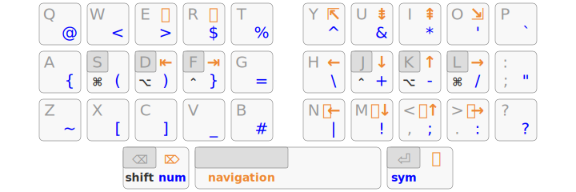
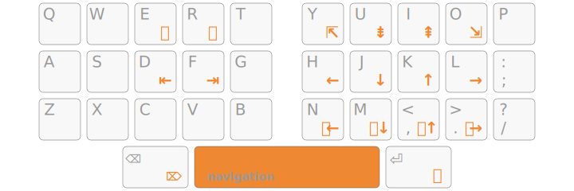

Selenium33
================================================================================

A Vim-friendly Arsenik mod:

- 3 home-row mods per hand for <kbd>Ctrl</kbd>, <kbd>Alt</kbd>, <kbd>Super</kbd>
- 3 layer-tap keys under the thumbs: <kbd>Shift</kbd>/<kbd>Backspace</kbd>,
<kbd>Navigation</kbd>/<kbd>Space</kbd>, <kbd>Symbol</kbd>/<kbd>Return</kbd>

Selenium uses 4 layers (instead of 3 for Arsenik), which makes it a natural fit
for 34-key keyboards like the [Ferris][34].

[34]: https://github.com/pierrechevalier83/ferris

Extended Navigation
--------------------------------------------------------------------------------

- Vim-like navigation in all apps, with any OS layout
- super-comfortable <kbd>Tab</kbd> and <kbd>Shift</kbd>-<kbd>Tab</kbd>
- mouse emulation: previous / next and mouse scroll
- easy left-hand shortcuts

This -kbd>Navigation</kbd> layer has a few empty slots on purpose, so you can
add our own keys or layers.

NumRow >> NumPad
--------------------------------------------------------------------------------

In <kbd>Symbol</kbd> mode, pressing the left thumb key brings up the
<kbd>NumRow</kbd> layer:

- all digits are on the home row, in the order you already know
- the upper row helps with <kbd>Shift</kbd>-digit shortcuts
- the lower row has dash, comma, dot and slash signs to help with number / date
inputs

Even on keyboards that *do* have a physical number row, this <kbd>NumRow</kbd>
layer can be interesting to use in order to minimize finger movements further
more. And it makes it easier to mix symbols with numbers (e.g. `[0]`).

Download
--------------------------------------------------------------------------------

Why The Name?
--------------------------------------------------------------------------------

