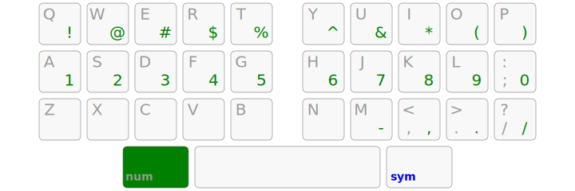

Selenium33
================================================================================

A Vim-friendly Arsenik mod:

- 3 home-row mods per hand for <kbd>Ctrl</kbd>, <kbd>Alt</kbd>, <kbd>Super</kbd>
- 3 layer-tap keys under the thumbs: <kbd>Shift</kbd>/<kbd>Backspace</kbd>,
<kbd>Navigation</kbd>/<kbd>Space</kbd>, <kbd>Symbol</kbd>/<kbd>Return</kbd>

Extended Navigation
--------------------------------------------------------------------------------

- <kbd>Shift</kbd>, <kbd>Backspace</kbd>, <kbd>Return</kbd> under the thumbs!
- all programming symbols in the comfortable 3×10 zone
- symmetrical modifiers on the home row
- Vim-like navigation in all apps
- easier left-hand shortcuts
- works with any keyboard

NumRow >> NumPad
--------------------------------------------------------------------------------

In <kbd>Symbol</kbd> mode, pressing the left thumb key brings up the
<kbd>NumRow</kbd> layer:

- all digits are on the home row, in the order you already know
- the upper row helps with <kbd>Shift</kbd>-digit shortcuts
- the lower row has dash, comma, dot and slash signs to help with number / date
inputs

Even on keyboards that *do* have a number row, this <kbd>NumRow</kbd> layer can
be interesting to use in order to minimize finger movements a bit more.

Download
--------------------------------------------------------------------------------

